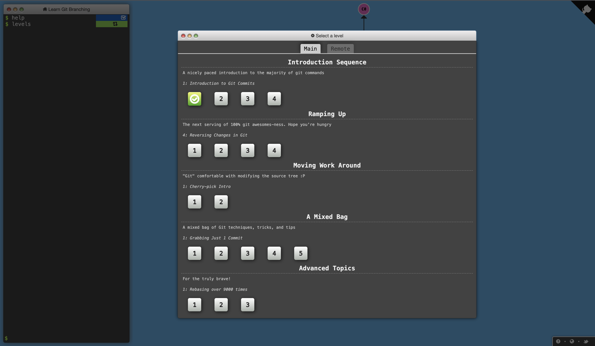

# Introduction to Git, GitHub and Pull Requests

## Context

### Git

Git is a distributed version control system that tracks changes in any set of computer files, usually used for coordinating work among programmers collaboratively writing code during software development.

Version control is a system that records changes to a file or set of files over time so that you can recall specific versions later.

Git is the most widely used version control system in the world today and is considered the modern standard for software development.

### GitHub

GitHub is one of the most popular code hosting platform for version control and collaboration, and is commonly used by many major technology companies. It lets you and others work together on projects from anywhere.

### Pull Requests

Pull requests is a popular tool that allows teams to collaborate on Git branches and efficiently review each other's code.

Pull requests let you tell others about changes you've pushed to a branch in a repository on GitHub. Once a pull request is opened, you can discuss and review the potential changes with collaborators and add follow-up commits before your changes are merged into the base branch.

[Click here to learn more on how to evaluate / review peer projects]

## Task

We'll be making use of "Learn Git Branching" to learn more about the basics and advanced concepts of Git.

"Learn Git Branching" is a visual and interactive way to learn Git on the web; you'll be challenged with exciting levels, given step-by-step demonstrations of powerful features, and even have a bit of fun along the way.

Visit https://learngitbranching.js.org/ and start playing with it!

## Resources to learn more:
### [Pro Git book](https://git-scm.com/book/en/v2)
Pro Git (Second Edition) is your fully-updated guide to Git and its usage in the modern world

### [Atlassian's tutorial to Git](https://www.atlassian.com/git/tutorials)
Comprehensive beginner's guide to Git complete with

